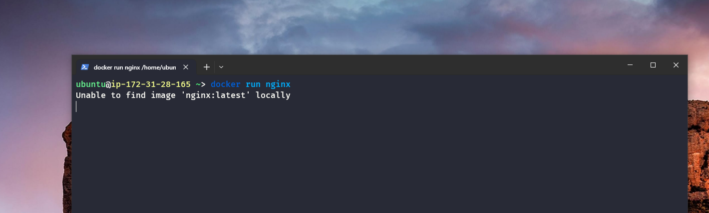
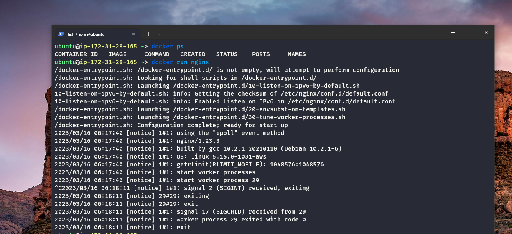
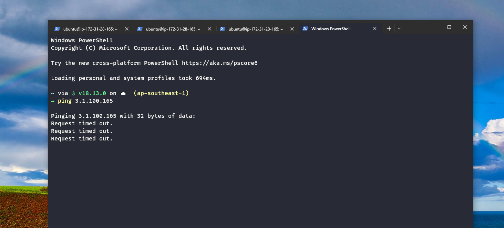

# Docker Egress Traffic Control Practical Guide

In this documentation, we will cover

 1. Namespace to Bridge Communication
 2. Namespace to Root Namespace Communication via Bridge
 3. Internet Connectivity | ping 8.8.8.8
 4. Access to Namespace from Outside of the network

## What is Docker?

Docker is a set of platform as a service products that use OS-level virtualization to deliver software in packages called containers. Containers are isolated from one another and bundle their own software, libraries and configuration files; they can communicate with each other through well-defined channels. All containers are run by a single operating-system kernel and are thus more lightweight than virtual machines. Containers are created from images that specify their precise contents.

First of all we need to install docker on our machine. You can follow the official documentation to install docker on your machine. [https://docs.docker.com/engine/install/](https://docs.docker.com/engine/install/)

```bash
sudo apt-get update
sudo apt-get install docker.io
```

Then we give a command to run docker to run nginx container.First docker couldn't find the image so it downloaded it from docker hub. Then it started the container and we can see the container id. We can see the container id by running the following command.

```bash
docker run nginx 
```
<!-- add a image from images folder -->



Here we are getting some error

    It seems like this is the output of the start-up process of an Nginx container using Docker.The first few lines indicate that the docker-entrypoint.sh script is being executed to perform configuration, with shell scripts in the /docker-entrypoint.d/ directory being launched.

    The following lines indicate that IPv6 has been enabled and worker processes have been started.

    The last few lines suggest that a SIGINT signal (interrupt signal) was received, likely due to the container being stopped.



If you remove all unused containers, networks, images (both dangling and unreferenced), and optionally, volumes, you can free up space.It will run perfectly.

```bash
docker system prune -a
```


