# Docker Egress Traffic Control Practical Guide

In this documentation, we will cover

 1. Namespace to Bridge Communication
 2. Namespace to Root Namespace Communication via Bridge
 3. Internet Connectivity | ping 8.8.8.8
 4. Access to Namespace from Outside of the network

## What is Docker?

Docker is a set of platform as a service products that use OS-level virtualization to deliver software in packages called containers. Containers are isolated from one another and bundle their own software, libraries and configuration files; they can communicate with each other through well-defined channels. All containers are run by a single operating-system kernel and are thus more lightweight than virtual machines. Containers are created from images that specify their precise contents.

First of all we need to install docker on our machine. You can follow the official documentation to install docker on your machine. [https://docs.docker.com/engine/install/](https://docs.docker.com/engine/install/)

```bash
sudo apt-get update
sudo apt-get install docker.io
```

Then we give a command to run docker to run nginx container.First docker couldn't find the image so it downloaded it from docker hub. Then it started the container and we can see the container id. We can see the container id by running the following command.

```bash
docker run nginx 
```
<!-- add a image from images folder -->

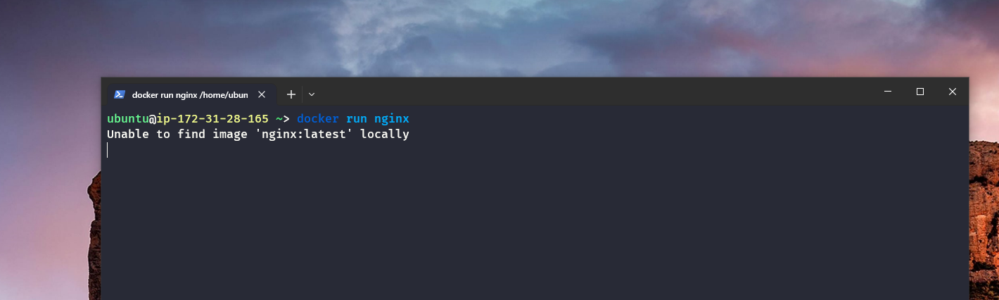

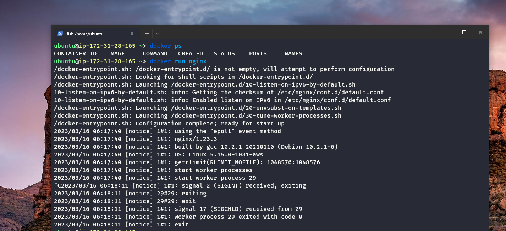

    It seems like this is the output of the start-up process of an Nginx container using Docker.The first few lines indicate that the docker-entrypoint.sh script is being executed to perform configuration, with shell scripts in the /docker-entrypoint.d/ directory being launched.The following lines indicate that IPv6 has been enabled and worker processes have been started.The last few lines suggest that a SIGINT signal (interrupt signal) was received, likely due to the container being stopped.

If you remove all unused containers, networks, images (both dangling and unreferenced), and optionally, volumes, you can free up space.It will run perfectly.

```bash
docker system prune -a
```

<!-- What is difference between Docker image and Container  -->

## What is Docker Image?

A Docker image is a read-only template with instructions for creating a Docker container. An image is made up of a series of layers, each of which represents a Dockerfile instruction. The layers are stacked and each one is a delta of the changes from the layer below. Docker images are stored in a Docker registry. Docker Hub is a public registry that anyone can use, and Docker is configured to look for images on Docker Hub by default.

## What is Docker Container?

A Docker container is a runnable instance of a Docker image. You can create, start, stop, move, or delete a container using the Docker API or CLI. When you run an image, you create a new container based on that image; that is, a new writable layer is added to the read-only layers that make up the image. Every container that is created from an image shares the same read-only layers. However, each container has its own writable layer. This writable layer is what allows the container to have its own unique filesystem, hostname, network settings, and more. The writable layer is also the part of the container that is deleted when the container is deleted.

<!-- How many ways we can use nginx -->

## How many ways we can use nginx?

There are three ways to use nginx.

 1. We can use nginx as a web server.
 2. We can use nginx as a reverse proxy.
 3. We can use nginx as a load balancer.

### What is a Web Server?

A web server is a computer system that processes requests via HTTP, the basic network protocol used to distribute information on the World Wide Web. The term can refer to the entire system, or specifically to the software that accepts and supervises the HTTP requests.

### What is a Reverse Proxy?

A reverse proxy is a type of proxy server that retrieves resources on behalf of a client from one or more servers. These resources are then returned to the client, appearing as if they originated from the proxy server itself.

### What is a Load Balancer?

A load balancer is a device that distributes network or application traffic across a cluster of servers. Load balancers are used to increase capacity (concurrent users) and reliability of applications. Load balancers improve the overall performance of applications by shifting traffic from overloaded servers to less loaded servers.

We Learn from previous lesson networking stuff. Can we use this knowledge to investigate the nginx container and see what is going on inside of it? Let's try it.

```bash
docker run -it --rm --name nginx nginx bash
```

Now the question is can we reach the container from outside of the network with the help of the public IP address of the machine? We Can Check it by running the following command.

```bash
ping 3.1.100.165 
```

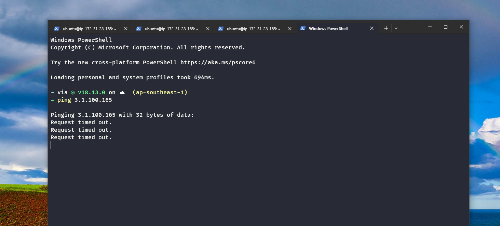

<!-- add a image from images folder -->

We can see that we can't ping the server because the server ping is not enabled. We can enable it by running the following command. Or we can run telnet command to check the server is running or not.

```bash
apt-get update
apt-get install telnet
telnet 3.1.100.165 22
```

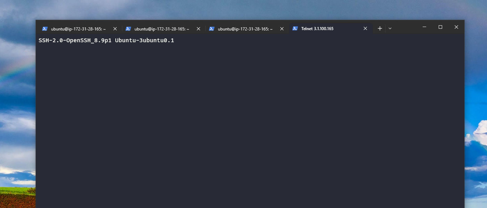

<!-- add a image from images folder -->

We see that we can connect to the server with the help of telnet.

### What is telnet?

Telnet is a protocol that allows you to connect to a remote computer and exchange data across the network. Telnet is a text-based protocol, which means that it only allows you to send and receive text. Telnet is a client-server protocol, which means that you need to have a server to connect to. Telnet is a connection-oriented protocol, which means that you need to establish a connection before you can send and receive data.

### What is ping?

Ping is a computer network administration software utility used to test the reachability of a host on an Internet Protocol (IP) network. It measures the round-trip time for messages sent from the originating host to a destination computer that are echoed back to the source. The program reports if the destination computer is reachable or not.

**Now the point is how we can reach the nginx container from outside of the network? What could be the approach to solve this problem ?**

First of all we need analyze  the networking stuff. We can see the network interface of the server by running the following command.

```bash
ifconfig
```

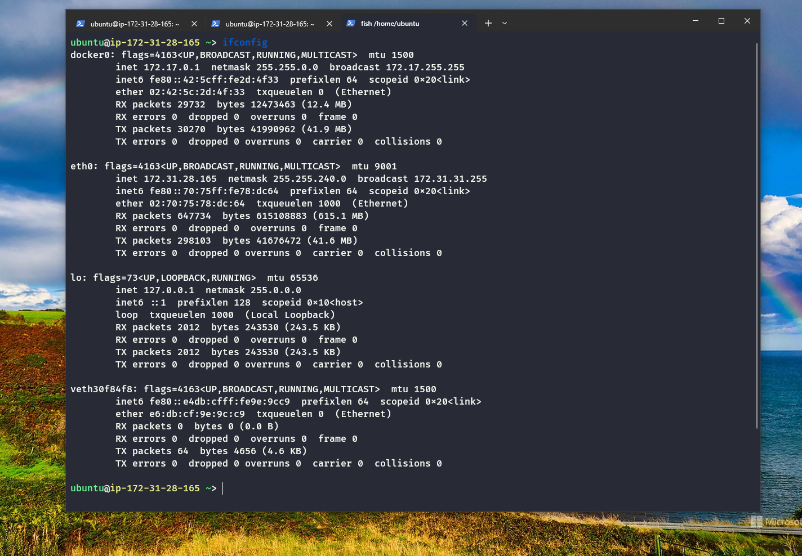

<!-- add a image from images folder -->

We can see that we have three network interfaces. One is the loopback interface and one is the docker interface and one is the public interface. We can see the docker interface by running the following command.

```bash
ifconfig docker0
```

We can see that the docker interface is in the switch or bridge mode. It can create local area network. Switch is used to connect multiple devices together on a single network. Switches use MAC addresses to forward data and make sure that it reaches the correct device.It is a layer 2 device. It is a hardware device. It is used to connect multiple devices together on a single network. Switches use MAC addresses to forward data and make sure that it reaches the correct device.

If we need our container to access the internet.As Like as we want to `ping 8.8.8.8`. The Packet will be sent to the docker interface. Docker interface tell that your destination is not in my network.

So the talk is docker0 is a getaway for the container. Container's attached to the docker0 interface. So How many containers can be attached to the docker0 interface? The answer is how many ports are available in the docker0 interface.

Let's assume that we connect 2 containers to the docker0 switch. So docker0 assign 2 ip address to the containers. One is `172.17.0.2` and another one is `172.17.0.3`. So the question is can we ping the container `172.17.0.2` from the container `172.17.0.3`? The answer is yes. We can ping the container. Because the docker0 interface is in the switch mode. So we can ping the container. But the question is can we ping the container `172.17.0.3` from `8.8.8.8`. Then the switch can't ping the container. Because the container is not in the same network as the switch. So the container can't ping the switch. So the container can't ping the internet.

So the question is when container's connected to the docker0 interface. Which ip range is assigned to the container? The answer is `172.17.0.1/16` ip range is assigned to the container. So the docker container prefix is `172.17`.

We have a command to check docker bridge network. The command is `docker network ls`. We can see the docker bridge network by running the following command.

```bash
docker network ls
```

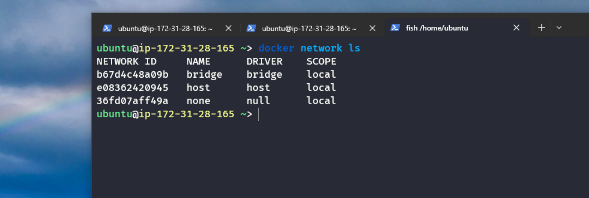

<!-- add a image from images folder -->

We can see that we have three networks. One is the bridge network. One is the host network. One is the none network. We can see the bridge network by running the following command.

```bash
docker network inspect [network ID]
```

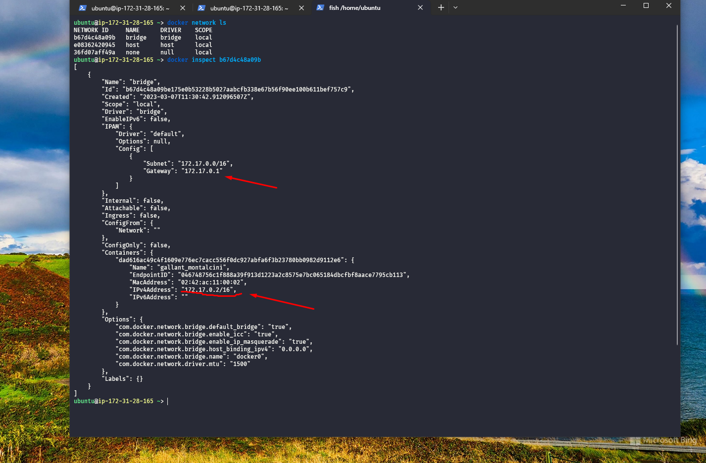

<!-- add a image from images folder -->

We can see the container ip address. So can we ping the container from the host machine? The answer is yes. But why we can ping the container from the host machine? How we can find the answer? We can find the answer by running the following command.

```bash
route -n
```

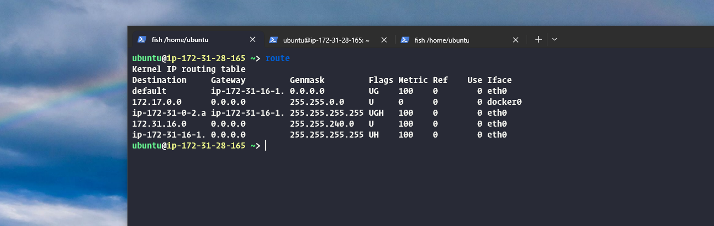

<!-- add a image from images folder -->

We can see here that the kernel route table. The Destination is the `172.17.0.0` and the Genmask is `255.255.0.0` and the Gateway is `0.0.0.0`. So when a packet comes to the host machine with prefix `172.17`. The packet will send to the dokcer0 interface. And the docker0 interface will send the packet to the container. So we can ping the container from the host machine.

How can we validate the above statement? We can validate the above statement by running the following command.

```bash
docker exec -it [container ID] bash
```

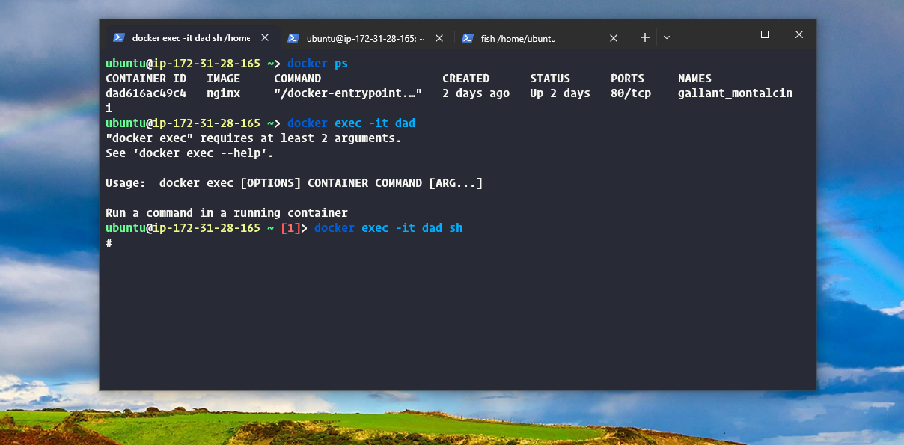

<!-- add a image from images folder -->

Now we entered into the container world. We can install tcpdump by running the following command.

```bash
apt-get update
apt-get install tcpdump
```
<!-- Describe The whole command with detail -->

Now we can see the packet by running the following command.

```bash
tcpdump -i eth0
```

This command will start capturing network traffic on the eth0 interface. You can use this command to view packets as they are transmitted and received on the network interface. You can also add various options to customize the output of the command, such as filtering packets by source or destination IP address or by protocol.

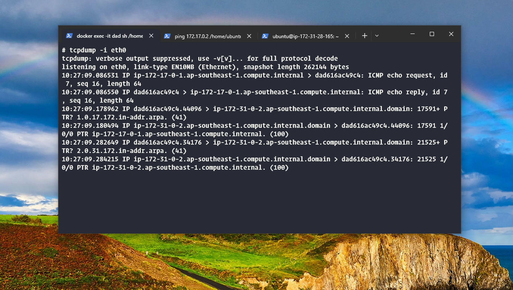

<!-- add a image from images folder -->

**The Question is can we ping from the container to the internet? The answer is yes. What would be the workflow?**

```bash

apt-get update
apt-get install iputils-ping
ping 8.8.8.8    
```

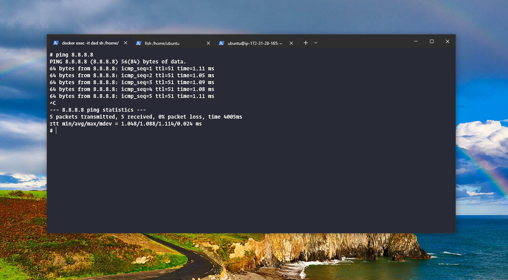

We can see the workflow by listing it.

- First the packet will be sent to the `docker0` interface.
- Then the `docker0` interface can't find the destination ip address in the same network.
- So the `docker0` interface will send the packet to the host machine.
- The host machine see the route table. and it says that the destination ip address is in the `8.8.8.8` network. The destination ip address is not maching with all the ip address in the route table. So the host machine will send the packet through the `eth0` interface. As a default gateway.
- The `eth0` interface will send the packet to the internet.


So we can ping the container from the host machine. And we can ping the internet from the container.

