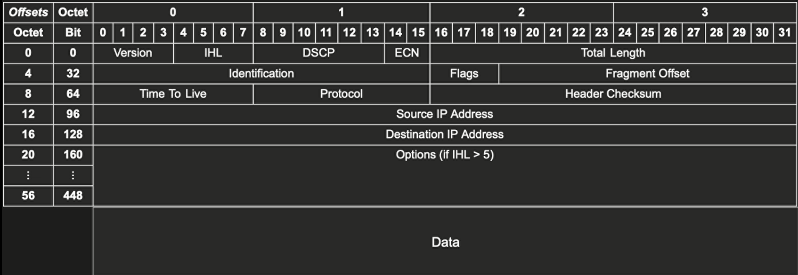

# Ip Header Format and Tcpdump Command Line Tool with Scenario Examples

## What is IP Header Format?

The IP header is the first part of the IP packet. It contains the source and destination IP addresses, the protocol, and other information. The IP header is 20 bytes long. The IP header is the first part of the IP packet. It contains the source and destination IP addresses, the protocol, and other information. The IP header is 20 bytes long.

<!-- Insert here an image markdown -->


<!-- Write IP Header Fields indetail -->

# 🌍 IP Header Fields

## 📥 Source IP Address and 📤 Destination IP Address

The source IP address field in the IP header identifies the sender of the packet, while the destination IP address field identifies the intended recipient of the packet. Just like sending a letter, you need to put your address (source IP) and the address of the recipient (destination IP) on the envelope to ensure it gets delivered to the right place.

## 📦 Type of Service (TOS) and 🚥 Differentiated Services Code Point (DSCP)

The TOS field is used to specify the priority and quality of service for the packet. In modern IP networks, the TOS field is usually replaced by the DSCP field, which allows for more granular QoS control.

## 🕰️ Identification

The identification field is used to uniquely identify each IP packet. This field is used in fragmentation and reassembly of IP packets.

## 🎨 Flags

The flags field contains three bits used to control fragmentation of IP packets. The first bit is the "reserved" bit and is always set to zero. The second bit is the "don't fragment" (DF) bit, which, when set, indicates that the packet should not be fragmented. The third bit is the "more fragments" (MF) bit, which, when set, indicates that the packet is part of a fragmented packet and that more fragments are expected.

## 🧱 Fragment Offset

The fragment offset field is used to indicate the offset of the current fragment relative to the start of the original IP packet. This field is used in fragmentation and reassembly of IP packets.

## 🔒 Time to Live (TTL)

The TTL field is used to limit the lifetime of an IP packet. The value in this field is decremented by one at each router hop, and if it reaches zero, the packet is discarded.

## 🧭 Protocol

The protocol field is used to identify the transport protocol that is carried in the payload of the IP packet. For example, TCP, UDP, ICMP, etc.

## 📐 Header Checksum

The header checksum field is used to ensure the integrity of the IP header. It is computed over the entire IP header, and any changes to the header will result in a different checksum value.

## 📦 Options

The options field is used to carry additional information about the IP packet. This field is optional and is not often used in practice.

## 📈 Total Length

The total length field specifies the length of the entire IP packet, including the IP header and the payload. The maximum value for this field is 65,535 bytes.

## 🧬 Version

The version field specifies the version of the IP protocol. Currently, the most widely used version is IPv4 (version 4), but there is also a newer version called IPv6 (version 6).

## 🚦 Header Length

The header length field specifies the length of the IP header in 32-bit words. This field is used to determine the start of the payload in the IP packet.

## 🔑 Options Padding

The options padding field is used to ensure that the IP header is aligned on a 32-bit boundary. This field is only used if the options field is present.

## 🐬 Tcpdump - The Packet Dolphin

Tcpdump is a powerful tool for network administrators and security professionals that allows them to capture and analyze network traffic in real-time. It acts as a network packet sniffer and can capture packets as they are transmitted over a network. Let's see how Tcpdump works using a story about a packet dolphin named Tcpdump.

🐬 Once upon a time, there was a packet dolphin named Tcpdump. Tcpdump lived in a vast ocean of network traffic and had the special ability to capture any packet that swam by. Tcpdump was a master of his craft and could capture packets of all shapes and sizes.

🌊 Whenever a packet would swim by, Tcpdump would use his powerful nose to sniff out the packet and capture it in his jaws. Once the packet was captured, Tcpdump would analyze its contents and extract useful information.

📦 Tcpdump was able to capture and analyze packets at different layers of the network stack, including the link layer, network layer, and transport layer. Tcpdump could see the source and destination addresses, the type of protocol being used, and even the payload of the packet.

🔍 Tcpdump was especially useful for troubleshooting network issues, as he could capture packets and identify the root cause of the problem. He could also be used for security analysis, as he could capture packets and detect malicious traffic, such as viruses or malware.

💻 Tcpdump was not just a tool for packet capture, but also had a powerful command-line interface that allowed network administrators and security professionals to filter and analyze packets based on specific criteria. This made it easy to find packets of interest and analyze them in more detail.

📊 Tcpdump was also able to output captured packets in a variety of formats, including ASCII, hexadecimal, and even pcap format. This made it easy to share captured packets with other tools and analyze them using different software.

🌟 In summary, Tcpdump was a powerful packet dolphin that could capture and analyze network traffic in real-time. It was an essential tool for network administrators and security professionals, and its ability to capture packets at different layers of the network stack made it an invaluable asset for troubleshooting and security analysis.

## 📦 Tcpdump Command Line Options

The following table lists the most commonly used command-line options for Tcpdump.

| Option | Description |
| --- | --- |
| -A | Print the packet in ASCII format. |
| -B | Set the buffer size for capturing packets. |
| -C | Rotate the output file after a specified number of megabytes. |
| -D | List the network interfaces available on the system. |
| -E | Decrypt encrypted traffic. |
| -F | Set the output file format. |
| -G | Rotate the output file after a specified number of seconds. |
| -H | Print the packet in HTTP format. |
| -I | Read packets from a live capture. |
| -J | Set the output file format to JSON. |
| -K | Set the output file format to Kafka. |
| -L | List the link-layer types available on the system. |
| -N | Do not resolve hostnames. |
| -O | Print the packet in SMB format. |
| -P | Print the packet in PPP format. |
| -Q | Print the packet in NFS format. |
| -R | Read packets from a pcap file. |
| -S | Print the packet in SMB2 format. |
| -T | Set the output file format. |
| -U | Print the packet in UDP format. |
| -V | Print the version of Tcpdump. |
| -W | Write packets to a pcap file. |
| -X | Print the packet in hexadecimal format. |
| -Z | Set the user to run Tcpdump as. |
|

## 1. How to get the HTTPS traffic with Tcpdump ? 📦

```bash
tcpdump -nnSX port 443 -w https.pcap -i eth0 
```

This showed some HTTPS traffic, with a hex display visible on the right portion of the output (alas, it’s encrypted). Just remember—when in doubt, run the command above with the port you’re interested in, and you should be on your way.  

## 2. For everything on an interface, what is the command?

```bash
tcpdump -i eth0
```

## 3. Write The command to find Traffic by IP

```bash
tcpdump -nnSX host
```

## 4. Share the filtering by Source and/or Destination?

```bash
tcpdump -nnSX src host
```

## 5. How to find Packets by Network, write the line

```bash
tcpdump -nnSX net
```

## Using packet contents with Hex Output, write the command

```bash
tcpdump -nnSX port 80 -X
```

 To find a specific port traffic, write the command.

```bash
tcpdump -nnSX port 80
```

Show Traffic of One Protocol command.

```bash
tcpdump -nnSX tcp
```

Write the command showing only IP6 Traffic.

```bash
tcpdump -nnSX ip6
```

Write the command for finding Traffic Using Port Ranges.

```bash
tcpdump -nnSX portrange 80-100
```

## What are PCAP (PEE-cap) files? How to capture packets to a PCAP file?

 PCAP (Packet Capture) files are files that contain network traffic data captured by a network analyzer tool such as Wireshark, tcpdump or WinPcap. These files are commonly used for network analysis, troubleshooting, and security assessments.

The PCAP format stores the raw network traffic data as it is captured from the network, including packet headers and payloads. This data can be analyzed to gain insight into the behavior of the network, identify network issues or security threats, and to reconstruct network communications for forensic investigations.

PCAP files can be opened and analyzed using various tools, including Wireshark, tcpdump, and NetworkMiner. These tools allow users to filter, sort, and search through the captured traffic data, and to extract specific information about network communications, such as IP addresses, protocols used, and data payloads.

## How are PCAP files processed and why is it so?

PCAP files can be processed using various tools and techniques depending on the specific use case or analysis being performed. Some common techniques include filtering, extraction, and visualization.

Filtering is a process of selecting specific packets from the PCAP file based on various criteria such as protocol, source or destination IP address, port number, packet length, or timestamp. This helps to isolate and focus on the relevant packets for analysis and reduces the noise or irrelevant traffic.

Extraction is a process of extracting specific information from the selected packets such as HTTP requests, email messages, or file transfers. This information can be used to reconstruct network communications and identify the root cause of network issues or security threats.

Visualization is a process of representing the network traffic data in a visual format such as graphs, charts, or diagrams. This helps to identify patterns or anomalies in the traffic and can provide a better understanding of the network behavior.

PCAP files are processed for various reasons, including network troubleshooting, performance analysis, security assessments, and forensic investigations. By analyzing PCAP files, network engineers and security professionals can gain valuable insights into network behavior, identify performance issues, detect security threats, and perform incident response.

## What is the command for reading I am writing to capture a File?

Sure, you can use the tcpdump command to read a PCAP file that you have previously written. To do this, use the -r switch to specify the name and location of the PCAP file you want to read, like this:

```bash
tcpdump -r capturefile.pcap
```

## Which switch is needed to read the PCAP files?

The -r switch is used to read a PCAP file that you have previously written. To do this, use the -r switch to specify the name and location of the PCAP file you want to read, like this:

```bash
tcpdump -r capturefile.pcap
```

## Which switch is used for the ethernet header?

The -e switch is used to display the Ethernet header. This is useful for identifying the source and destination MAC addresses of the packets.

```bash
tcpdump -e
```

## hat is Line-readable output? How is it notified?

Line-readable output is a format that displays the packet data in a human-readable format. This is useful for quickly identifying the source and destination IP addresses, ports, and protocols used in the packets.

To display the packet data in line-readable format, use the -tttt switch, like this:

```bash
tcpdump -l -i eth0
```

## What does -q implify?

The -q switch is used to simplify the output by only displaying the packet data. This is useful for quickly identifying the source and destination IP addresses, ports, and protocols used in the packets.

```bash
tcpdump -q
```

## What does this tweak: -t work?

The -t switch is used to display the packet data in a human-readable format. This is useful for quickly identifying the source and destination IP addresses, ports, and protocols used in the packets.

```bash
tcpdump -t
```

## What does -tttt show?

The -tttt switch is used to display the packet data in a human-readable format. This is useful for quickly identifying the source and destination IP addresses, ports, and protocols used in the packets.

```bash
tcpdump -tttt
```

## Purpose for -vv ?

The purpose of the -vv option in tcpdump is to increase the verbosity level of the output. When used twice, it provides more detailed information about the packets being captured, including the entire IP and TCP/UDP headers in hexadecimal and ASCII format. This can be useful for troubleshooting network issues or analyzing network traffic in greater detail.

```bash
tcpdump -vv
```

## What is the purpose of -vvv?

The purpose of the -vvv option in tcpdump is to increase the verbosity level of the output. When used three times, it provides the most detailed information about the packets being captured, including the entire Ethernet, IP, and TCP/UDP headers in hexadecimal and ASCII format. This can be useful for troubleshooting network issues or analyzing network traffic in greater detail.

```bash
tcpdump -vvv
```

## What does -S, -e, -q, -E implify?

Here is a brief explanation of the options you mentioned in tcpdump:

-S: Print absolute sequence numbers instead of relative ones. This option is useful for analyzing TCP sequence number behavior.

-e: Print the link-level header on each dump line. This option displays the Ethernet header (or other link-layer header) of each captured packet.

-q: Quiet mode. Suppress the printing of packet headers and other verbose output.

-E: Set a decryption engine to be used to decrypt the captured packets. This option is used when capturing encrypted traffic and requires a decryption engine, such as OpenSSL, to be installed.

Each of these options can be useful for different purposes when analyzing network traffic with tcpdump. The -S option, for example, can help you understand how TCP sequence numbers are behaving, which can be important for diagnosing issues with TCP connections. The -e option is useful for seeing the link-layer header of each packet, which can help you understand how the packet was transmitted over the network. The -q option is useful for simplifying the output when you only need to see the packet data, without any extra information. Finally, the -E option is used when capturing encrypted traffic that needs to be decrypted.

## How to show the raw output view?

To display the raw output view in tcpdump, you can use the -X or -xx option.

The -X option will display the packet data in ASCII and hex format, and the -xx option will display the packet data in pure hexadecimal format.

## If a Non ICMP Traffic Goes to a Specific IP, what should be the query?

If you want to capture non-ICMP traffic (e.g. TCP, UDP) going to a specific IP address, you can use the tcpdump command with a filter expression that specifies the destination IP address and excludes ICMP packets.

For example, if you want to capture all non-ICMP traffic going to the IP address 192.168.0.10 on interface eth0, you can use the following command:

```bash
tcpdump -i eth0 dst host 192.168.0.10 and not icmp
```

## The command line for Find SSH Connections?

To find SSH connections, you can use the following command:

```bash
sudo tcpdump -i <interface> 'tcp port 22'

```

Replace <interface> with the name of the interface you want to monitor, such as eth0 or wlan0. This command will capture all TCP traffic on port 22, which is the default port used by SSH.

Note that you need to run this command with root privileges using sudo as it requires access to the network interfaces.

## How to Find DNS Traffic?

To find DNS traffic, you can use the following command:

```bash
sudo tcpdump -i <interface> 'udp port 53'
```

## Find NTP Traffic, what is the command?

To find NTP traffic, you can use the following command:

```bash
sudo tcpdump -i <interface> 'udp port 123'
```

## Command to Find Cleartext Passwords?

in situations where you have permission to monitor network traffic and you suspect that cleartext passwords are being transmitted, you can use the following command with tcpdump:

```bash
sudo tcpdump -i <interface> -A -s0 'tcp port http' | grep -i -E 'pass=|pwd=|password=|user=|username=|login='

```

Replace <interface> with the name of the interface you want to monitor, such as eth0 or wlan0. This command captures all TCP traffic on port 80 (HTTP) and filters the output to show only packets containing specific keywords such as pass=, pwd=, password=, user=, username=, or login=. The -A flag tells tcpdump to print each packet in ASCII text, and -s0 sets the snap length to the maximum value, so that the entire packet payload is captured.

## Describe Evil bit

The evil bit is a flag that is set in the IP header of a packet when it is sent from a host that is infected with the Conficker worm. This flag is used by the worm to identify other hosts that are infected with the worm, so that it can spread to them. The evil bit is set in the IP header of a packet when it is sent from a host that is infected with the Conficker worm. This flag is used by the worm to identify other hosts that are infected with the worm, so that it can spread to them.
